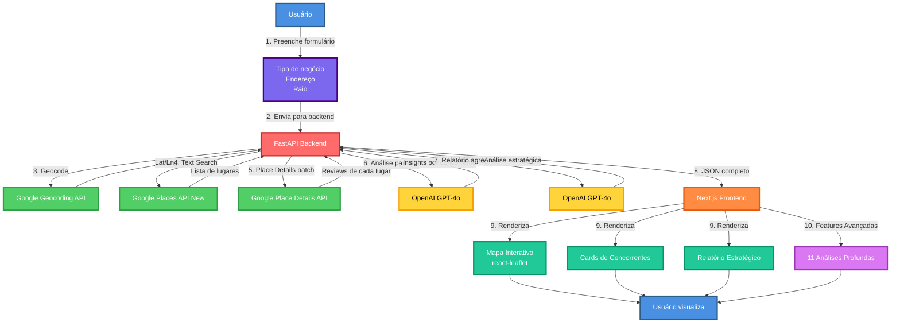
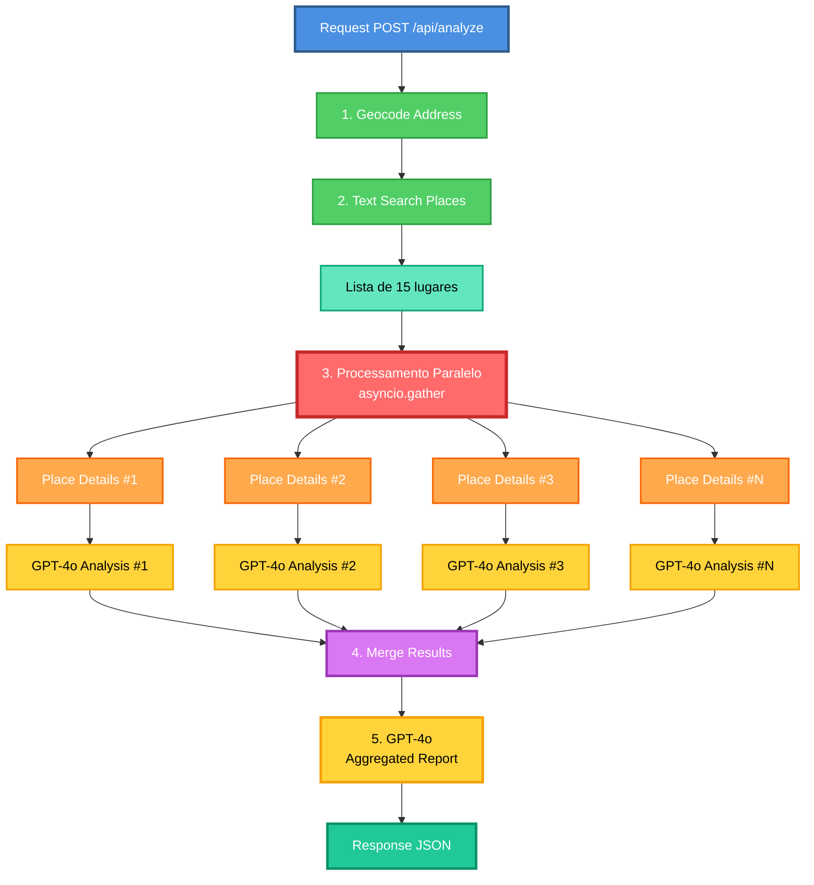
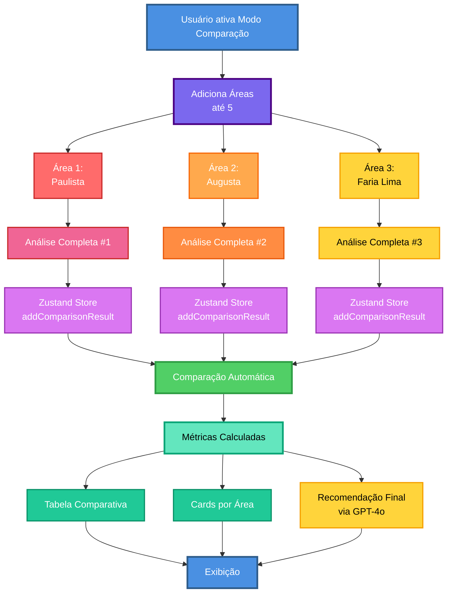
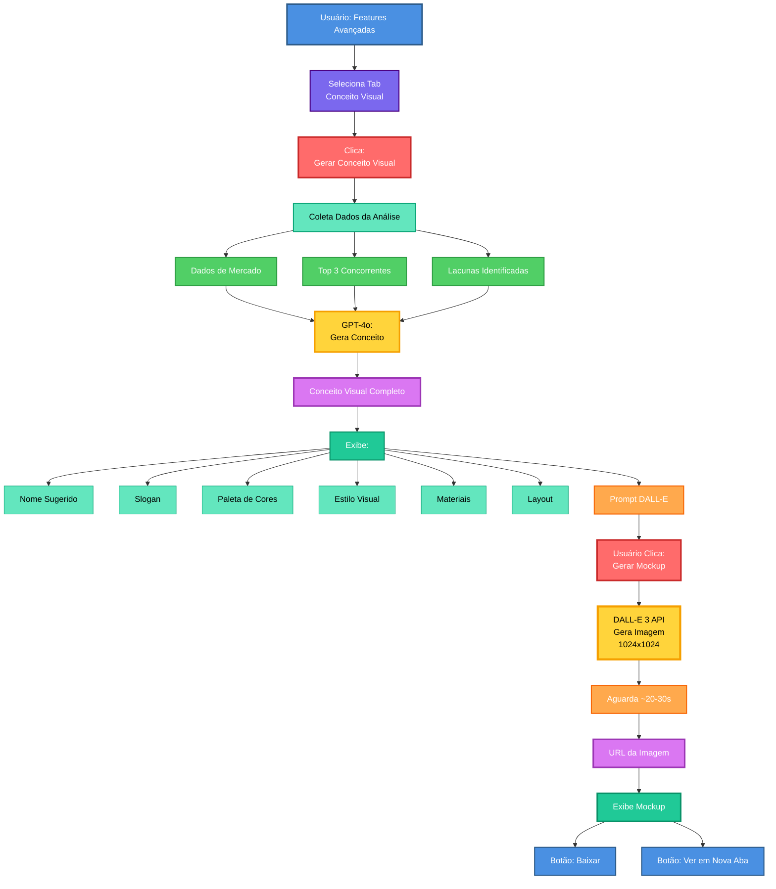
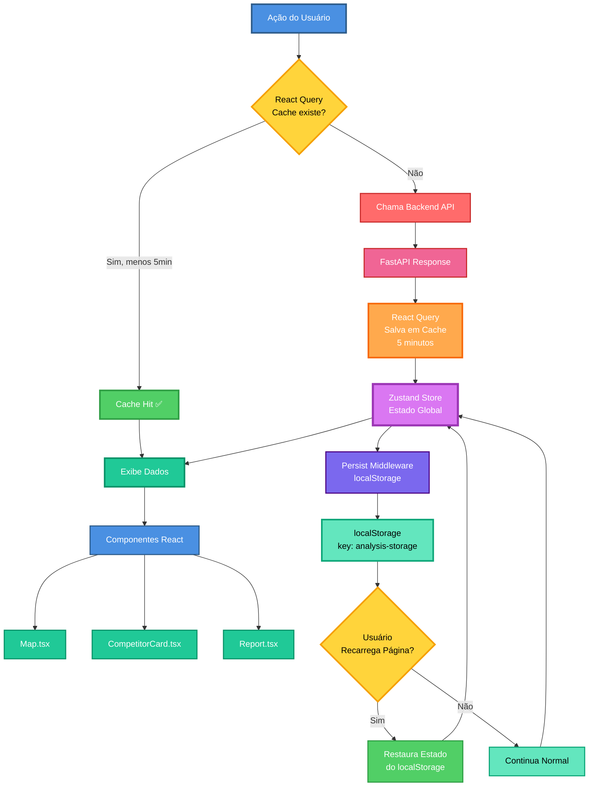
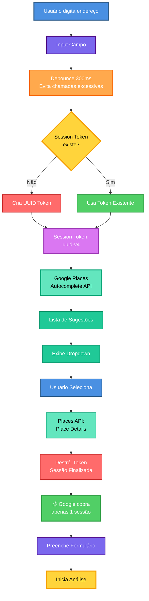
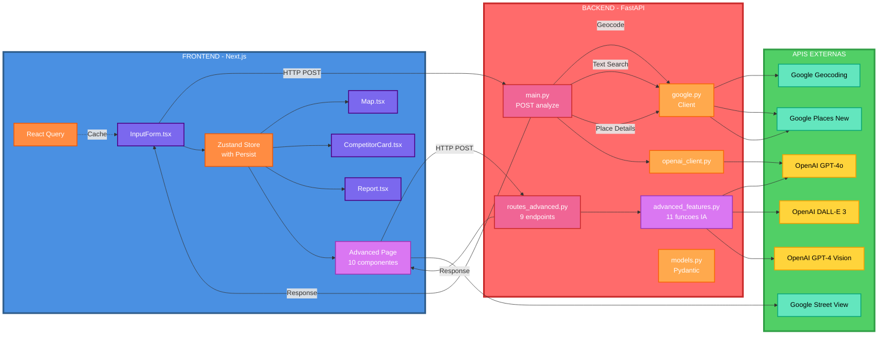
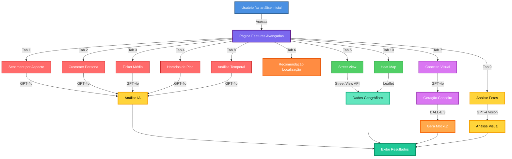

<div align="center">

# 🎯 IntelliMarket Analyzer

### **Inteligência de Mercado Local Potencializada por IA**

*Descubra concorrentes, analise reviews automaticamente e identifique oportunidades estratégicas em minutos*

[](https://nextjs.org/)
[](https://fastapi.tiangolo.com/)
[](https://openai.com/)
[](https://developers.google.com/maps)
[](https://openai.com/)
[](https://opensource.org/licenses/MIT)

</div>

---

## 📑 Índice

- [📖 O que este projeto faz?](#-o-que-este-projeto-faz)
- [🎨 Fluxo Completo do Sistema](#-fluxo-completo-do-sistema)
- [🔄 Fluxos Detalhados do Sistema](#-fluxos-detalhados-do-sistema)
- [🏗️ Arquitetura do Sistema](#️-arquitetura-do-sistema)
- [✨ Features Principais](#-features-principais)
- [🔬 Features Avançadas](#-features-avançadas-11-análises-profundas)
- [🛠️ Tech Stack](#️-tech-stack)
- [🚀 Como Rodar o Projeto](#-como-rodar-o-projeto)
- [🔐 Configuração de Variáveis de Ambiente](#-configuração-de-variáveis-de-ambiente)
- [💰 Custos Estimados das APIs](#-custos-estimados-das-apis)
- [📡 Documentação da API](#-documentação-da-api)
- [💻 Exemplos de Código](#-exemplos-de-código)
- [📁 Estrutura do Projeto](#-estrutura-do-projeto)
- [🎯 Casos de Uso](#-casos-de-uso)
- [📸 Screenshots](#-screenshots)
- [💡 Decisões de Design e Boas Práticas](#-decisões-de-design-e-boas-práticas)
- [🔧 Troubleshooting](#-troubleshooting)
- [🗺️ Roadmap](#️-roadmap)
- [🤝 Como Contribuir](#-como-contribuir)

---

## 📖 O que este projeto faz?

**IntelliMarket Analyzer** é uma aplicação web completa que automatiza a pesquisa de mercado local usando **Inteligência Artificial**. 

### 🎬 Como funciona:

1. **Você informa:** tipo de negócio + endereço + raio de busca
2. **A aplicação:**
   - 🔍 Busca concorrentes na região (Google Places API)
   - 📊 Coleta e analisa reviews com IA (OpenAI GPT-4o)
   - 📈 Identifica pontos fortes, fracos e oportunidades
   - 🗺️ Exibe tudo em mapa interativo + relatórios detalhados
   - 🔬 **Análises avançadas:** 11 tipos diferentes de insights profundos

### 💡 Para quem é?

- Empreendedores planejando abrir um negócio
- Consultores de estratégia fazendo análise competitiva
- Investidores avaliando viabilidade de mercado
- Empresas querendo entender a concorrência local

---

## 🎨 Fluxo Completo do Sistema



---

## 🔄 Fluxos Detalhados do Sistema

### **1. Processamento Paralelo (Backend)**



**⚡ Por que é rápido?**
- Geocoding: ~100ms
- Text Search: ~200ms  
- Place Details (paralelo): ~1-2s (15 lugares simultâneos)
- AI Analysis (paralelo): ~3-5s (15 análises simultâneas)
- Aggregated Report: ~2s
- **Total: ~15-30 segundos** (sem paralelização seria ~120s! 🐌)

---

### **2. Modo Comparação de Áreas**



---

### **3. DALL-E 3: Conceito → Mockup**



**💰 Custo:** ~$0.07 (GPT-4o $0.03 + DALL-E 3 $0.04)

---

### **4. Estado e Cache: React Query + Zustand**



**Benefícios:**
- ✅ React Query: Cache automático de 5 minutos
- ✅ Zustand + Persist: Estado sobrevive a recarregamentos
- ✅ localStorage: Dados persistem até nova análise
- ✅ Performance: Evita re-fetching desnecessário

---

### **5. Session Tokens: Autocomplete Otimizado**



**💰 Economia de Custos:**

| Cenário | Custo |
|---------|-------|
| **Sem Session Tokens** | ~$0.10 (16 requisições) |
| **Com Session Tokens** | ~$0.017 (1 sessão) |
| **Economia** | **83%!** 🎉 |

---

## 🏗️ Arquitetura do Sistema



---

## ✨ Features Principais

### 🔍 **Busca Inteligente**
- ✅ Busca por **texto livre** (ex: "café artesanal", "pizzaria")
- ✅ **Autocomplete inteligente** com Google Places Autocomplete (New)
  - Session tokens para reduzir custos
  - Sugestões em tempo real
  - Formatação estruturada de endereços
- ✅ Raio configurável de **100m até 50km** com slider interativo
- ✅ Usa Google Places API **New** (última versão)
- ✅ Geocoding automático de endereços

### ⚖️ **Modo Comparar Áreas** 🆕
- ✅ **Compare até 5 áreas diferentes** simultaneamente
- ✅ Adicione/remova áreas dinamicamente
- ✅ Visualização comparativa em tabela
- ✅ Cards resumidos por área
- ✅ Análise paralela de múltiplas regiões
- ✅ Métricas comparativas:
  - Número de concorrentes
  - Saturação de mercado
  - Sentimento médio
  - Principais oportunidades

### 🤖 **Análise por IA**
- ✅ **GPT-4o** analisa reviews de cada concorrente
- ✅ Extrai automaticamente:
  - Score de sentimento (0-10) com emoji visual
  - 3-5 pontos fortes
  - 3-5 pontos fracos
  - 2-3 oportunidades acionáveis
  - Resumo executivo
- ✅ **Relatório agregado** do mercado:
  - Nível de saturação (Baixa/Média/Alta)
  - Forças do mercado
  - Lacunas e oportunidades
  - Recomendação estratégica

### 🎨 **UI/UX Moderna** 🆕
- ✅ Design moderno com **glassmorphism**
- ✅ Gradientes vibrantes e coloridos
- ✅ Animações suaves e transições
- ✅ Background animado com blobs
- ✅ Cards interativos com hover effects
- ✅ Tipografia Inter para melhor legibilidade
- ✅ Responsivo e mobile-friendly
- ✅ Loading states animados
- ✅ Empty states informativos
- ✅ **Persistência de estado** (localStorage)

### 🗺️ **Visualização**
- ✅ Mapa interativo com **Leaflet**
- ✅ Marcadores coloridos por sentimento
- ✅ Popups detalhados
- ✅ Cards detalhados por concorrente
- ✅ Relatório estratégico visual
- ✅ Badges e chips informativos

### ⚡ **Performance**
- ✅ Análises de IA em **paralelo** (asyncio)
- ✅ Requisições em batch (ThreadPoolExecutor)
- ✅ Cache com React Query
- ✅ FieldMask para otimizar custos de API
- ✅ Debounce no autocomplete
- ✅ Lazy loading de componentes
- ✅ Dynamic imports para evitar SSR issues

---

## 🔬 Features Avançadas (11 Análises Profundas)

Após a análise inicial, acesse **Features Avançadas** para insights ainda mais profundos:

### 1. 📸 **Street View dos Concorrentes**
- ✅ Fotos reais das fachadas via Google Street View API
- ✅ Grid visual com todos os concorrentes
- ✅ Ratings e scores de sentimento
- ✅ Links diretos para Google Maps
- **Tecnologia:** Google Street View Static API

### 2. 🧠 **Análise de Sentiment por Aspecto**
- ✅ GPT-4o analisa 6 aspectos diferentes:
  - 🤝 Atendimento
  - 📦 Produto/Qualidade
  - 💵 Preço
  - 🏠 Ambiente
  - 📍 Localização
  - ⚡ Agilidade
- ✅ Score 0-10 para cada aspecto
- ✅ Pontos positivos e negativos por aspecto
- ✅ Gráfico visual com cores indicativas
- **Tecnologia:** GPT-4o com prompt estruturado

### 3. 👥 **Persona do Cliente Ideal**
- ✅ GPT-4o gera perfil completo:
  - Demografia (idade, renda, profissão)
  - Comportamento de compra
  - Valores e prioridades
  - Dores e desejos
  - Como conquistar esse cliente
- ✅ Cards visuais para cada seção
- ✅ Baseado em padrões dos reviews
- **Tecnologia:** GPT-4o com análise comportamental

### 4. 💰 **Estimativa de Ticket Médio**
- ✅ GPT-4o extrai menções de preços nos reviews
- ✅ Calcula faixa de preços (mínimo/máximo)
- ✅ Percepção de valor (caro/justo/barato)
- ✅ Produtos mencionados com preços
- ✅ Sensibilidade a preços do público
- ✅ Estratégia de precificação recomendada
- **Tecnologia:** GPT-4o com extração de entidades

### 5. 🎯 **Recomendação de Localização Ideal**
- ✅ Funciona com o modo "Comparar Áreas"
- ✅ Ranking das melhores localizações
- ✅ Pros e contras de cada área
- ✅ Score ponderado considerando múltiplos fatores
- ✅ Recomendação final detalhada
- **Tecnologia:** GPT-4o com análise comparativa

### 6. 🎨 **Conceito Visual com IA**
- ✅ GPT-4o cria identidade visual completa:
  - Conceito principal
  - Esquema de cores
  - Estilo de design
  - Materiais e iluminação
  - Layout e distribuição
  - Diferenciais visuais
- ✅ Prompt otimizado para DALL-E 3
- ✅ Interface moderna com cards
- **Tecnologia:** GPT-4o para conceituação

### 7. 🖼️ **Geração de Mockup com DALL-E 3**
- ✅ Gera imagem visual do conceito
- ✅ Qualidade 1024x1024 (standard ou HD)
- ✅ Download direto da imagem
- ✅ Visualização inline
- ✅ Baseado no conceito criado pelo GPT-4o
- **Tecnologia:** DALL-E 3 API
- **Custo:** ~$0.04 por imagem (standard)

### 8. 🕐 **Análise de Horários de Pico**
- ✅ GPT-4o identifica padrões de movimento
- ✅ Horários de pico (manhã, almoço, jantar, noite)
- ✅ Dias mais/menos movimentados
- ✅ Tempo de espera (médio/pico/fora de pico)
- ✅ Reclamações sobre espera
- ✅ Oportunidades de horários
- ✅ Recomendação de operação
- ✅ Gráficos de barras animados
- **Tecnologia:** GPT-4o com análise temporal

### 9. 📈 **Análise Temporal de Tendências**
- ✅ GPT-4o analisa evolução ao longo do tempo
- ✅ Sentimento geral (melhorando/estável/piorando)
- ✅ Problemas emergentes recentes
- ✅ Melhorias percebidas
- ✅ Sazonalidade (períodos de alta/baixa)
- ✅ Competidores crescendo vs. declinando
- ✅ Melhor momento para entrar no mercado
- **Tecnologia:** GPT-4o com análise de reviews datados

### 10. 📸 **Análise de Fotos com GPT-4 Vision**
- ✅ GPT-4 Vision analisa fotos das fachadas
- ✅ Identifica:
  - Estilo de decoração
  - Esquema de cores
  - Tamanho do espaço
  - Nível de movimento
  - Estado de conservação
  - Diferenciais visuais
  - Pontos fortes e fracos do design
- ✅ Analisa até 5 fotos simultaneamente
- **Tecnologia:** GPT-4o com capacidade Vision
- **Custo:** ~$0.01 por foto

### 11. 🗺️ **Heat Map de Saturação**
- ✅ Mapa interativo com círculos de calor
- ✅ Cores indicam saturação:
  - 🟢 Verde: Baixa saturação (0-30%)
  - 🟡 Amarelo: Média (30-50%)
  - 🟠 Laranja: Média-alta (50-70%)
  - 🔴 Vermelho: Alta saturação (70-100%)
- ✅ Tamanho do círculo: influência do concorrente
- ✅ Opacidade: concentração
- ✅ Popups com detalhes ao clicar
- ✅ Estatísticas agregadas
- ✅ Insights automáticos
- **Tecnologia:** React Leaflet + CircleMarker

---

## 🛠️ Tech Stack

### **Frontend**
| Tecnologia | Versão | Uso |
|------------|--------|-----|
|  | 14.2.12 | Framework React |
|  | 5.6.3 | Tipagem estática |
|  | 3.4.13 | Estilização |
|  | 1.9.4 | Mapas interativos |
|  | 4.5.2 | State + Persist |
|  | 5.56.2 | Cache e data fetching |

### **Backend**
| Tecnologia | Versão | Uso |
|------------|--------|-----|
|  | 0.115.2 | Framework web |
|  | 3.10+ | Linguagem |
|  | 2.9.2 | Validação de dados |
|  | 1.47.0 | SDK Python |
|  | 0.30.6 | Servidor ASGI |

### **APIs Externas**
- 🗺️ **Google Geocoding API** - Conversão endereço → lat/lng
- 📍 **Google Places API (New)** - Text Search + Place Details
- 📸 **Google Street View API** - Fotos das fachadas
- 🤖 **OpenAI GPT-4o** - Análise de reviews e insights
- 🎨 **OpenAI DALL-E 3** - Geração de imagens
- 👁️ **OpenAI GPT-4 Vision** - Análise visual de fotos

---

## 📡 Documentação da API

### **POST /api/analyze**

Endpoint principal que realiza toda a análise de mercado.

#### **Request Body**
```json
{
  "business_type": "café artesanal",
  "address": "Avenida Paulista, 1000, São Paulo, SP",
  "radius": 2000
}
```

| Campo | Tipo | Obrigatório | Descrição |
|-------|------|-------------|-----------|
| `business_type` | string | ✅ | Tipo de negócio em texto livre |
| `address` | string | ✅ | Endereço completo |
| `radius` | integer | ✅ | Raio em metros (100-50000) |

#### **Response (200 OK)**
Retorna JSON com `competitors`, `aggregated_report`, `center`, `radius`, e `meta`.

---

### **Features Avançadas - Endpoints**

#### **POST /api/advanced/sentiment-by-aspect**
Analisa sentimento por 6 aspectos diferentes.

**Request:**
```json
{
  "reviews": ["Review 1", "Review 2", "..."],
  "business_type": "café"
}
```

**Response:** Scores 0-10 para cada aspecto + pontos positivos/negativos.

---

#### **POST /api/advanced/customer-persona**
Gera persona completa do cliente ideal.

**Request:**
```json
{
  "analysis_data": { "strengths": [...], "weaknesses": [...] },
  "business_type": "restaurante"
}
```

**Response:** Demografia, comportamento, valores, dores, estratégia de conquista.

---

#### **POST /api/advanced/ticket-estimate**
Estima ticket médio baseado em menções de preços.

**Request:**
```json
{
  "reviews": ["Review 1", "Review 2", "..."],
  "business_type": "pizzaria"
}
```

**Response:** Faixa de preços, produtos com valores, percepção, estratégia.

---

#### **POST /api/advanced/peak-hours**
Analisa horários de pico e padrões de movimento.

**Request:**
```json
{
  "reviews": ["Review 1", "Review 2", "..."],
  "popular_times_data": null
}
```

**Response:** Horários de pico, dias mais/menos movimentados, tempo de espera, oportunidades.

---

#### **POST /api/advanced/review-trends**
Analisa tendências temporais dos reviews.

**Request:**
```json
{
  "reviews_with_dates": [
    {"text": "Ótimo!", "date": "2024-01-15", "rating": 5},
    ...
  ],
  "business_type": "café"
}
```

**Response:** Tendência geral, problemas emergentes, melhorias, sazonalidade, competidores em movimento.

---

#### **POST /api/advanced/location-recommendation**
Recomenda melhor localização (modo comparação).

**Request:**
```json
{
  "comparison_data": [
    {"area": "Área 1", "saturation": 45, "competitors": 5},
    {"area": "Área 2", "saturation": 75, "competitors": 12}
  ],
  "business_type": "academia"
}
```

**Response:** Ranking de áreas, pros/contras, recomendação final.

---

#### **POST /api/advanced/photo-analysis**
Analisa fotos com GPT-4 Vision.

**Request:**
```json
{
  "image_urls": [
    "https://maps.googleapis.com/maps/api/streetview?...",
    "https://..."
  ],
  "business_type": "restaurante"
}
```

**Response:** Análise visual (decoração, cores, espaço, conservação, diferenciais).

---

#### **POST /api/advanced/visual-concept**
Gera conceito visual detalhado.

**Request:**
```json
{
  "business_type": "café",
  "market_analysis": { "saturation": 50, "top_competitors": [...] },
  "persona": { "target": "...", "needs": [...] },
  "best_practices": ["Atendimento de qualidade", "..."]
}
```

**Response:** Conceito principal, elementos visuais, layout, diferenciais, prompt DALL-E.

---

#### **POST /api/advanced/generate-mockup**
Gera imagem com DALL-E 3.

**Request:**
```json
{
  "prompt": "Modern minimalist café interior with warm lighting, wood accents..."
}
```

**Response:**
```json
{
  "success": true,
  "image_url": "https://oaidalleapiprodscus.blob.core.windows.net/...",
  "revised_prompt": "..."
}
```

---

## 💻 Exemplos de Código

### **Fluxo de Features Avançadas**



---

### **1. Uso Básico - Python (Backend)**

#### **Chamar a API de Análise**

```python
import requests
import json

# Configuração
API_URL = "http://localhost:8000"

def analyze_market(business_type: str, address: str, radius: int = 2000):
    """
    Analisa o mercado local para um tipo de negócio
    
    Args:
        business_type: Tipo de negócio (ex: "café artesanal")
        address: Endereço completo
        radius: Raio de busca em metros (100-50000)
    
    Returns:
        dict: Análise completa com concorrentes e relatório
    """
    endpoint = f"{API_URL}/api/analyze"
    
    payload = {
        "business_type": business_type,
        "address": address,
        "radius": radius
    }
    
    print(f"🔍 Analisando mercado de '{business_type}' em {address}...")
    
    response = requests.post(endpoint, json=payload)
    response.raise_for_status()
    
    data = response.json()
    
    print(f"✅ Encontrados {len(data['competitors'])} concorrentes")
    print(f"📊 Saturação: {data['aggregated_report']['market_saturation_level']}")
    
    return data

# Exemplo de uso
if __name__ == "__main__":
    result = analyze_market(
        business_type="cafeteria artesanal",
        address="Avenida Paulista, 1000, São Paulo, SP",
        radius=1500
    )
    
    # Salvar resultado
    with open("analise_mercado.json", "w", encoding="utf-8") as f:
        json.dump(result, f, ensure_ascii=False, indent=2)
    
    print("\n💾 Análise salva em 'analise_mercado.json'")
```

---

#### **Usar Features Avançadas - Sentiment por Aspecto**

```python
import requests

def analyze_sentiment_by_aspect(reviews: list, business_type: str):
    """
    Analisa sentimento por 6 aspectos diferentes
    """
    endpoint = "http://localhost:8000/api/advanced/sentiment-by-aspect"
    
    payload = {
        "reviews": reviews,
        "business_type": business_type
    }
    
    print(f"🧠 Analisando sentiment por aspecto...")
    
    response = requests.post(endpoint, json=payload)
    response.raise_for_status()
    
    data = response.json()["data"]
    
    # Exibir resultados
    print("\n📊 ANÁLISE POR ASPECTO:\n")
    for aspecto, detalhes in data["aspectos"].items():
        score = detalhes["score"]
        emoji = "😊" if score >= 8 else "😐" if score >= 6 else "😞"
        print(f"{emoji} {aspecto}: {score}/10")
        print(f"   👍 Positivo: {detalhes['pontos_positivos'][0]}")
        print(f"   👎 Negativo: {detalhes['pontos_negativos'][0]}")
        print()
    
    return data

# Exemplo de uso
reviews = [
    "Café excelente, mas o atendimento é lento",
    "Ambiente muito agradável, preço justo",
    "Qualidade top, mas estacionamento difícil"
]

sentiment_analysis = analyze_sentiment_by_aspect(
    reviews=reviews,
    business_type="café"
)
```

---

#### **Gerar Mockup com DALL-E 3**

```python
import requests
from PIL import Image
from io import BytesIO

def generate_visual_concept_and_mockup(business_type: str, market_data: dict):
    """
    Gera conceito visual e mockup com DALL-E 3
    """
    # Passo 1: Gerar conceito visual
    print("🎨 Gerando conceito visual com GPT-4o...")
    
    concept_response = requests.post(
        "http://localhost:8000/api/advanced/visual-concept",
        json={
            "business_type": business_type,
            "market_analysis": {
                "saturation": market_data.get("saturation_percentage", 50),
                "top_competitors": [c["place"]["display_name"] for c in market_data["competitors"][:3]],
                "avg_rating": sum(c["place"]["rating"] for c in market_data["competitors"]) / len(market_data["competitors"])
            },
            "persona": {
                "target": f"Cliente ideal para {business_type}",
                "needs": market_data["aggregated_report"]["market_weaknesses_gaps"][:3]
            },
            "best_practices": market_data["aggregated_report"]["market_strengths_summary"][:3]
        }
    )
    
    concept = concept_response.json()["data"]
    
    print(f"\n💡 Conceito: {concept['conceito_principal']}")
    print(f"🎨 Estilo: {concept['elementos_visuais']['estilo_design']}")
    print(f"🌈 Cores: {concept['elementos_visuais']['esquema_cores']}")
    
    # Passo 2: Gerar imagem com DALL-E 3
    print("\n🖼️  Gerando mockup com DALL-E 3 (aguarde ~30s)...")
    
    mockup_response = requests.post(
        "http://localhost:8000/api/advanced/generate-mockup",
        json={
            "prompt": concept["prompt_dalle"]
        }
    )
    
    mockup_data = mockup_response.json()
    image_url = mockup_data["image_url"]
    
    print(f"✅ Mockup gerado: {image_url}")
    
    # Baixar e salvar imagem
    image_response = requests.get(image_url)
    img = Image.open(BytesIO(image_response.content))
    img.save(f"mockup_{business_type.replace(' ', '_')}.png")
    
    print(f"💾 Imagem salva como 'mockup_{business_type.replace(' ', '_')}.png'")
    
    return concept, image_url

# Exemplo de uso (após análise inicial)
# concept, mockup_url = generate_visual_concept_and_mockup("café moderno", result)
```

---

### **2. Uso Básico - JavaScript/TypeScript (Frontend)**

#### **Chamar a API do Frontend**

```typescript
// lib/api.ts
import { useQuery, useMutation } from '@tanstack/react-query';

interface AnalyzeRequest {
  business_type: string;
  address: string;
  radius: number;
}

interface AnalyzeResponse {
  competitors: any[];
  aggregated_report: any;
  center: { latitude: number; longitude: number };
  radius: number;
}

// Hook para análise de mercado
export function useMarketAnalysis() {
  return useMutation({
    mutationFn: async (data: AnalyzeRequest): Promise<AnalyzeResponse> => {
      const response = await fetch('http://localhost:8000/api/analyze', {
        method: 'POST',
        headers: {
          'Content-Type': 'application/json',
        },
        body: JSON.stringify(data),
      });

      if (!response.ok) {
        throw new Error('Erro ao analisar mercado');
      }

      return response.json();
    },
    onSuccess: (data) => {
      console.log(`✅ Análise completa: ${data.competitors.length} concorrentes`);
    },
  });
}

// Uso no componente
function AnalysisForm() {
  const { mutate, isLoading, data } = useMarketAnalysis();

  const handleSubmit = (e: React.FormEvent) => {
    e.preventDefault();
    
    mutate({
      business_type: 'café artesanal',
      address: 'Avenida Paulista, 1000, São Paulo',
      radius: 2000,
    });
  };

  return (
    <form onSubmit={handleSubmit}>
      <button type="submit" disabled={isLoading}>
        {isLoading ? '⏳ Analisando...' : '🔍 Analisar Mercado'}
      </button>
    </form>
  );
}
```

---

#### **Usar Zustand Store (Gestão de Estado)**

```typescript
// store/useAnalysisStore.ts
import { create } from 'zustand';
import { persist, createJSONStorage } from 'zustand/middleware';

interface AnalysisState {
  result: any | null;
  comparisonResults: any[];
  isLoading: boolean;
  comparisonMode: boolean;
  
  setResult: (result: any) => void;
  addComparisonResult: (result: any) => void;
  clearComparison: () => void;
  setIsLoading: (loading: boolean) => void;
  setComparisonMode: (mode: boolean) => void;
}

export const useAnalysisStore = create<AnalysisState>()(
  persist(
    (set) => ({
      result: null,
      comparisonResults: [],
      isLoading: false,
      comparisonMode: false,

      setResult: (result) => set({ result }),
      
      addComparisonResult: (result) =>
        set((state) => ({
          comparisonResults: [...state.comparisonResults, result],
        })),
      
      clearComparison: () => set({ comparisonResults: [] }),
      
      setIsLoading: (isLoading) => set({ isLoading }),
      
      setComparisonMode: (comparisonMode) => set({ comparisonMode }),
    }),
    {
      name: 'analysis-storage', // localStorage key
      storage: createJSONStorage(() => localStorage),
    }
  )
);

// Uso no componente
function Results() {
  const { result, comparisonResults, comparisonMode } = useAnalysisStore();

  if (comparisonMode && comparisonResults.length > 0) {
    return <ComparisonView results={comparisonResults} />;
  }

  if (result) {
    return <SingleAnalysisView result={result} />;
  }

  return <EmptyState />;
}
```

---

#### **Features Avançadas - React Component**

```typescript
// components/advanced/SentimentAnalysis.tsx
'use client';

import { useState } from 'react';
import { useAnalysisStore } from '@/store/useAnalysisStore';

export default function SentimentAnalysis() {
  const { result } = useAnalysisStore();
  const [sentimentData, setSentimentData] = useState<any>(null);
  const [loading, setLoading] = useState(false);

  const analyzeSentiment = async () => {
    setLoading(true);
    
    try {
      // Coleta reviews de todos os concorrentes
      const reviews: string[] = [];
      result?.competitors?.forEach((competitor: any) => {
        competitor.place.reviews?.forEach((review: any) => {
          if (review.text?.text) {
            reviews.push(review.text.text);
          }
        });
      });

      // Chama API de sentiment
      const response = await fetch('http://localhost:8000/api/advanced/sentiment-by-aspect', {
        method: 'POST',
        headers: { 'Content-Type': 'application/json' },
        body: JSON.stringify({
          reviews,
          business_type: result?.request?.business_type || 'estabelecimento',
        }),
      });

      const data = await response.json();
      setSentimentData(data.data);
    } catch (error) {
      console.error('Erro ao analisar sentiment:', error);
    } finally {
      setLoading(false);
    }
  };

  return (
    <div className="space-y-6">
      <button
        onClick={analyzeSentiment}
        disabled={loading}
        className="px-6 py-3 bg-blue-600 text-white rounded-lg hover:bg-blue-700 disabled:opacity-50"
      >
        {loading ? '⏳ Analisando...' : '🧠 Analisar Sentiment'}
      </button>

      {sentimentData && (
        <div className="grid gap-4">
          {Object.entries(sentimentData.aspectos).map(([aspecto, detalhes]: [string, any]) => (
            <div key={aspecto} className="p-4 bg-white rounded-lg shadow">
              <h3 className="font-bold text-lg">{aspecto}</h3>
              <div className="text-2xl font-bold text-blue-600">
                {detalhes.score}/10
              </div>
              <div className="mt-2">
                <p className="text-sm text-green-600">
                  👍 {detalhes.pontos_positivos[0]}
                </p>
                <p className="text-sm text-red-600">
                  👎 {detalhes.pontos_negativos[0]}
                </p>
              </div>
            </div>
          ))}
        </div>
      )}
    </div>
  );
}
```

---

### **3. Script Completo de Automação**

```python
#!/usr/bin/env python3
"""
Script de automação para análise de múltiplas áreas
"""

import requests
import json
from datetime import datetime
from pathlib import Path

class IntelliMarketClient:
    def __init__(self, base_url="http://localhost:8000"):
        self.base_url = base_url
    
    def analyze_market(self, business_type, address, radius=2000):
        """Análise principal de mercado"""
        response = requests.post(
            f"{self.base_url}/api/analyze",
            json={
                "business_type": business_type,
                "address": address,
                "radius": radius
            }
        )
        response.raise_for_status()
        return response.json()
    
    def compare_areas(self, business_type, addresses, radius=2000):
        """Compara múltiplas áreas"""
        results = []
        
        for i, address in enumerate(addresses, 1):
            print(f"\n📍 Analisando área {i}/{len(addresses)}: {address}")
            result = self.analyze_market(business_type, address, radius)
            results.append({
                "address": address,
                "competitors_count": len(result["competitors"]),
                "saturation": result.get("saturation_percentage", 0),
                "avg_rating": sum(c["place"]["rating"] for c in result["competitors"]) / len(result["competitors"]) if result["competitors"] else 0,
                "analysis": result
            })
        
        # Ordenar por melhor oportunidade (menor saturação + boa avaliação)
        results.sort(key=lambda x: (x["saturation"], -x["avg_rating"]))
        
        return results
    
    def generate_report(self, results, business_type):
        """Gera relatório comparativo"""
        timestamp = datetime.now().strftime("%Y%m%d_%H%M%S")
        filename = f"relatorio_{business_type.replace(' ', '_')}_{timestamp}.md"
        
        with open(filename, "w", encoding="utf-8") as f:
            f.write(f"# Relatório de Análise: {business_type}\n\n")
            f.write(f"**Data:** {datetime.now().strftime('%d/%m/%Y %H:%M')}\n\n")
            f.write(f"## Resumo Executivo\n\n")
            f.write(f"Análise de {len(results)} áreas diferentes.\n\n")
            
            f.write("## Ranking de Áreas\n\n")
            for i, area in enumerate(results, 1):
                f.write(f"### {i}º - {area['address']}\n\n")
                f.write(f"- **Concorrentes:** {area['competitors_count']}\n")
                f.write(f"- **Saturação:** {area['saturation']:.1f}%\n")
                f.write(f"- **Rating Médio:** {area['avg_rating']:.1f}⭐\n\n")
                
                if i == 1:
                    f.write("🏆 **MELHOR LOCALIZAÇÃO**\n\n")
        
        print(f"\n📄 Relatório salvo: {filename}")
        return filename

# Exemplo de uso
if __name__ == "__main__":
    client = IntelliMarketClient()
    
    # Definir parâmetros
    business_type = "academia"
    areas = [
        "Avenida Paulista, 1000, São Paulo",
        "Rua Augusta, 500, São Paulo",
        "Faria Lima, 2000, São Paulo"
    ]
    
    print(f"🔍 Iniciando análise comparativa de '{business_type}'")
    print(f"📊 Áreas a analisar: {len(areas)}")
    
    # Executar análise
    results = client.compare_areas(business_type, areas, radius=1500)
    
    # Gerar relatório
    report_file = client.generate_report(results, business_type)
    
    # Exibir resultado
    print("\n✅ Análise completa!")
    print(f"🏆 Melhor localização: {results[0]['address']}")
    print(f"📊 Saturação: {results[0]['saturation']:.1f}%")
```

---

## 📁 Estrutura do Projeto

```
intellimarket-analyzer/
│
├── backend/                           # 🐍 Backend FastAPI
│   ├── app/
│   │   ├── clients/
│   │   │   ├── google.py             # Cliente Google Maps APIs
│   │   │   ├── openai_client.py      # Cliente OpenAI
│   │   │   └── advanced_features.py  # 🆕 11 funções de análise avançada
│   │   ├── core/
│   │   │   └── config.py             # Configurações e variáveis de ambiente
│   │   ├── main.py                   # Endpoint principal /api/analyze
│   │   ├── routes_advanced.py        # 🆕 9 endpoints avançados
│   │   └── models.py                 # Modelos Pydantic (request/response)
│   ├── requirements.txt              # Dependências Python
│   └── .env                          # Variáveis de ambiente (não commitado)
│
├── frontend/                          # ⚛️ Frontend Next.js
│   ├── app/
│   │   ├── layout.tsx                # Layout raiz (background animado)
│   │   ├── page.tsx                  # Página principal
│   │   └── advanced/                 # 🆕 Features Avançadas
│   │       └── page.tsx              # Página com 10 componentes
│   ├── components/
│   │   ├── CompetitorCard.tsx        # Card de cada concorrente
│   │   ├── ComparisonView.tsx        # 🆕 Modo comparação
│   │   ├── InputForm.tsx             # Formulário (+ comparison mode)
│   │   ├── Map.tsx                   # Mapa interativo (Leaflet)
│   │   ├── PlacesAutocomplete.tsx    # 🆕 Autocomplete Google
│   │   ├── Report.tsx                # Relatório agregado
│   │   └── advanced/                 # 🆕 11 componentes avançados
│   │       ├── StreetViewGallery.tsx
│   │       ├── SentimentByAspect.tsx
│   │       ├── CustomerPersona.tsx
│   │       ├── TicketEstimate.tsx
│   │       ├── PeakHours.tsx
│   │       ├── TemporalAnalysis.tsx
│   │       ├── LocationRecommendation.tsx
│   │       ├── PhotoAnalysis.tsx
│   │       ├── VisualConcept.tsx
│   │       └── HeatMap.tsx
│   ├── lib/
│   │   └── api.ts                    # Funções de chamada à API
│   ├── store/
│   │   └── useAnalysisStore.ts       # Estado global (Zustand + Persist)
│   ├── styles/
│   │   └── globals.css               # Estilos globais (Tailwind + customs)
│   ├── tailwind.config.ts            # 🆕 Configuração customizada
│   ├── package.json                  # Dependências Node
│   └── .env.local                    # Variáveis de ambiente (não commitado)
│
├── LICENSE                            # Licença MIT
└── README.md                          # Este arquivo
```

---

## 🚀 Como Rodar o Projeto

### **Pré-requisitos**
- Python 3.10+
- Node.js 18+
- Chaves de API:
  - **OpenAI API Key** (com acesso a GPT-4o, DALL-E 3, e Vision)
  - **Google Maps API Key** (com Places API New, Geocoding, e Street View habilitados)

### **1️⃣ Backend (FastAPI)**

```bash
# Navegue para a pasta backend
cd backend

# Crie um ambiente virtual
python -m venv .venv

# Ative o ambiente (macOS/Linux)
source .venv/bin/activate

# Ative o ambiente (Windows)
.venv\Scripts\activate

# Instale dependências
pip install -r requirements.txt

# Configure variáveis de ambiente
# Crie um arquivo backend/.env com suas chaves (veja seção abaixo)

# Inicie o servidor
uvicorn app.main:app --reload --port 8000
```

✅ Backend rodando em: `http://localhost:8000`  
📚 Documentação automática: `http://localhost:8000/docs`

---

### **2️⃣ Frontend (Next.js)**

```bash
# Navegue para a pasta frontend (em outro terminal)
cd frontend

# Instale dependências
npm install

# Configure variáveis de ambiente
# Crie um arquivo frontend/.env.local (veja seção abaixo)

# Inicie o servidor de desenvolvimento
npm run dev
```

✅ Frontend rodando em: `http://localhost:3000`  
🔬 Features Avançadas: `http://localhost:3000/advanced`

---

## 🔐 Configuração de Variáveis de Ambiente

### **backend/.env**
```env
# OpenAI (certifique-se de ter acesso a GPT-4o, DALL-E 3, e Vision)
OPENAI_API_KEY=sk-proj-xxxxxxxxxxxxxxxxxxxxxxxxxx

# Google Maps (habilite Places API New + Geocoding + Street View)
GOOGLE_MAPS_API_KEY=AIzaxxxxxxxxxxxxxxxxxxxxxxxxxx

# Tunables (opcional)
GOOGLE_PLACES_MAX_RESULTS=15
GOOGLE_REVIEWS_MAX_PER_PLACE=10
OPENAI_MODEL=gpt-4o
OPENAI_TEMPERATURE=0.2
LANGUAGE_CODE=pt-BR
```

### **frontend/.env.local**
```env
NEXT_PUBLIC_BACKEND_URL=http://localhost:8000

# Google Maps API Key (OBRIGATÓRIO para Autocomplete e Street View)
# Certifique-se de habilitar: Places API (New) + Autocomplete + Street View
NEXT_PUBLIC_GOOGLE_MAPS_API_KEY=AIzaxxxxxxxxxxxxxxxxxxxxxxxxxx
```

> ⚠️ **IMPORTANTE:** 
> - Nunca commite suas chaves de API! Os arquivos `.env` e `.env.local` já estão no `.gitignore`.
> - Para DALL-E 3 e GPT-4 Vision, certifique-se de que sua conta OpenAI tem acesso a esses modelos.
> - Google Street View é incluído com a API Key do Google Maps (sem custo adicional de habilitação).

---

## 💰 Custos Estimados das APIs

### **Google Maps Platform**
| API | Custo | Quando é usado |
|-----|-------|----------------|
| **Geocoding** | $0.005/requisição | 1x por análise |
| **Text Search (New)** | $0.032/requisição | 1x por análise |
| **Place Details (New)** | ~$0.017/requisição | 1x por concorrente (com reviews) |
| **Street View Static** | Grátis (até 28k/mês) | Features Avançadas |

**Exemplo:** Análise de 10 concorrentes = ~$0.21

### **OpenAI**
| Modelo | Custo | Quando é usado |
|--------|-------|----------------|
| **GPT-4o (Input)** | $2.50 / 1M tokens | Todas as análises |
| **GPT-4o (Output)** | $10.00 / 1M tokens | Todas as análises |
| **GPT-4o Vision** | $0.01 / imagem | Análise de Fotos |
| **DALL-E 3 (1024×1024)** | $0.04 / imagem | Geração de Mockup |
| **DALL-E 3 HD** | $0.08 / imagem | Geração de Mockup (HD) |

**Exemplo por análise completa:**
- Análise principal (10 concorrentes): ~$0.05-0.15
- Sentiment por aspecto: ~$0.03
- Persona: ~$0.02
- Ticket médio: ~$0.02
- Horários de pico: ~$0.03
- Temporal: ~$0.03
- Fotos Vision (5 fotos): ~$0.05
- Conceito visual: ~$0.03
- Mockup DALL-E 3: ~$0.04

**Total típico:** ~$0.30-0.45 por análise completa com todas as features avançadas

### 💡 **Dicas para Reduzir Custos:**
- Use limites conservadores (`GOOGLE_PLACES_MAX_RESULTS`, `GOOGLE_REVIEWS_MAX_PER_PLACE`)
- Implemente cache de análises já feitas
- Para DALL-E 3, use quality="standard" ao invés de "hd"
- Limite análise de fotos a 3-5 imagens por vez
- Use o modo comparação somente quando necessário

---

## 🎯 Casos de Uso

### **Exemplo 1: Abrir uma Cafeteria**
```json
{
  "business_type": "cafeteria artesanal",
  "address": "Rua Oscar Freire, 500, São Paulo",
  "radius": 1500
}
```
**Resultado:** Identifica 8 cafeterias no raio, mostra que clientes reclamam de preços altos e falta de opções veganas.  
**Oportunidade:** Abrir café com preços mais acessíveis e cardápio plant-based.  
**Features Avançadas Úteis:**
- 💰 Ticket Médio: Confirma faixa de preços alta ($25-35)
- 👥 Persona: Público jovem, consciente, valoriza sustentabilidade
- 🎨 Conceito Visual: Gera identidade para café vegano moderno

### **Exemplo 2: Academia**
```json
{
  "business_type": "academia",
  "address": "Barra da Tijuca, Rio de Janeiro",
  "radius": 3000
}
```
**Resultado:** Mercado saturado com 15 academias. Principais queixas: equipamentos antigos e horários limitados.  
**Oportunidade:** Academia 24h com equipamentos modernos.  
**Features Avançadas Úteis:**
- 🕐 Horários de Pico: Identifica que 7-9h e 18-21h são lotados
- 🗺️ Heat Map: Mostra área menos saturada a 500m do centro
- 📈 Análise Temporal: Revela que concorrentes estão perdendo clientes

### **Exemplo 3: Pet Shop**
```json
{
  "business_type": "pet shop",
  "address": "Centro, Curitiba",
  "radius": 2000
}
```
**Resultado:** Apenas 3 concorrentes, clientes elogiam produtos mas reclamam de falta de serviços.  
**Oportunidade:** Pet shop com banho, tosa e veterinário no local.  
**Features Avançadas Úteis:**
- 🧠 Sentiment por Aspecto: Produto 9/10, mas Serviços 4/10
- 📸 Street View: Confirma que concorrentes têm estrutura pequena
- 🎯 Recomendação: Sugere localização ideal com estacionamento

---

## 📸 Screenshots

### **Interface Principal**

<div align="center">

#### 🏠 Página Inicial e Formulário


*Interface moderna com glassmorphism e gradientes animados*

---

#### 📝 Autocomplete Inteligente


*Google Places Autocomplete com session tokens*

---

#### ⚖️ Modo Comparar Áreas


*Compare até 5 áreas diferentes simultaneamente*

</div>

---

### **Análise e Resultados**

<div align="center">

#### 🗺️ Mapa Interativo com Marcadores


*Mapa Leaflet com marcadores coloridos por sentimento*

---

#### 📊 Cards dos Concorrentes


*Análise detalhada de cada concorrente com IA*

---

#### 📈 Relatório Estratégico


*Saturação de mercado e recomendações*

---

#### 🔍 Detalhes do Concorrente


*Pontos fortes, fracos e oportunidades*

</div>

---

### **Features Avançadas (11 Análises Profundas)**

<div align="center">

#### 🔬 Menu de Features Avançadas


*10 tabs com análises especializadas*

---

#### 🧠 Sentiment por Aspecto


*Análise de 6 aspectos diferentes com scores*

---

#### 👥 Persona do Cliente Ideal


*Perfil completo do cliente ideal*

---

#### 💰 Estimativa de Ticket Médio


*Faixa de preços e estratégia de precificação*

---

#### 📸 Street View dos Concorrentes


*Fotos reais das fachadas via Google Street View*

---

#### 🕐 Análise de Horários de Pico


*Padrões de movimento e tempos de espera*

---

#### 🎯 Recomendação de Localização


*Ranking das melhores localizações (modo comparação)*

---

#### 🎨 Conceito Visual com IA


*Identidade visual completa gerada por IA*

---

#### 🖼️ Geração de Mockup com DALL-E 3


*Imagem profissional gerada pelo DALL-E 3*

---

#### 📈 Análise Temporal de Tendências


*Evolução do mercado ao longo do tempo*

---

#### 📸 Análise de Fotos com GPT-4 Vision


*Análise visual das fachadas com IA*

---

#### 🗺️ Heat Map de Saturação


*Mapa de calor interativo com círculos coloridos*

---

#### 📊 Estatísticas do Heat Map


*Métricas e insights de saturação*

</div>

---

### **Modo Comparação de Áreas**

<div align="center">

#### ⚖️ Tabela Comparativa


*Comparação lado a lado de múltiplas áreas*

---

#### 📊 Cards de Áreas Comparadas


*Métricas detalhadas por área*

---

#### 🎯 Recomendação Comparativa


*Ranking e análise das melhores áreas*

</div>

---

### **Interface em Ação**

<div align="center">

#### ⚡ Loading States


*Animações e estados de carregamento*

---

#### 🎨 UI Moderna


*Design com glassmorphism e gradientes*

</div>

---

## 💡 Decisões de Design e Boas Práticas

### **Backend**
- ✅ **FieldMask** em todas as chamadas Google Places para minimizar custos
- ✅ Limites configuráveis (`GOOGLE_PLACES_MAX_RESULTS`, `GOOGLE_REVIEWS_MAX_PER_PLACE`)
- ✅ Análises de IA em paralelo com `asyncio.gather()` (reduz latência)
- ✅ Requisições batch com `ThreadPoolExecutor` para Place Details
- ✅ Validação de dados com Pydantic
- ✅ CORS configurado para desenvolvimento
- ✅ Modularização: `advanced_features.py` separa lógica avançada
- ✅ Tratamento de erros robusto em todas as funções

### **Frontend**
- ✅ React Query para cache automático e estados de loading
- ✅ Zustand + Persist para estado global com localStorage
- ✅ TypeScript para type-safety
- ✅ Tailwind CSS para estilização rápida e consistente
- ✅ Componentes modulares e reutilizáveis
- ✅ Dynamic imports para evitar problemas de SSR (Leaflet)
- ✅ Session tokens no autocomplete para reduzir custos
- ✅ Lazy loading de componentes pesados
- ✅ Glassmorphism e animações para UX moderna

---

## 🔧 Troubleshooting

### **Problemas Comuns e Soluções**

#### **1. `window is not defined` - Next.js SSR**

**Problema:** Erro ao usar Leaflet no Next.js  
**Causa:** Leaflet acessa `window` que não existe no servidor

**Solução:** Já resolvido com dynamic imports
```typescript
import dynamic from 'next/dynamic';

const MapContainer = dynamic(
  () => import('react-leaflet').then((mod) => mod.MapContainer),
  { ssr: false }
);
```

---

#### **2. API OpenAI: "You exceeded your current quota"**

**Problema:** Créditos da API OpenAI esgotados  
**Causa:** Conta sem créditos ou limite atingido

**Solução:**
1. Acesse https://platform.openai.com/account/billing
2. Adicione créditos ($5-10 é suficiente para começar)
3. Verifique seu usage em https://platform.openai.com/account/usage

---

#### **3. Google Places API: "API key not valid"**

**Problema:** Chave da API Google não funciona  
**Causa:** API não habilitada ou restrições incorretas

**Solução:**
1. Acesse https://console.cloud.google.com/apis/library
2. Habilite as seguintes APIs:
   - Places API (New)
   - Geocoding API
   - Street View Static API
3. Em "Credentials", adicione restrições:
   - **Frontend:** Restrição HTTP referrers (localhost:3000)
   - **Backend:** Restrição de IP ou nenhuma (para desenvolvimento)

---

#### **4. Backend não inicia: `SyntaxError` em f-string**

**Problema:** Erro de sintaxe em f-strings  
**Causa:** Python < 3.10 ou erro em template string

**Solução:**
```bash
# Verificar versão do Python
python --version  # Deve ser 3.10+

# Se < 3.10, atualize:
# macOS
brew install python@3.11

# Ubuntu
sudo apt install python3.11

# Recriar venv
python3.11 -m venv .venv
source .venv/bin/activate
pip install -r requirements.txt
```

---

#### **5. Frontend não encontra variável de ambiente**

**Problema:** `process.env.NEXT_PUBLIC_GOOGLE_MAPS_API_KEY` é `undefined`  
**Causa:** Variável não tem prefixo `NEXT_PUBLIC_` ou servidor não foi reiniciado

**Solução:**
```bash
# 1. Verificar arquivo .env.local
cat frontend/.env.local

# 2. Certificar que tem o prefixo correto
NEXT_PUBLIC_GOOGLE_MAPS_API_KEY=AIza...

# 3. Reiniciar servidor Next.js
# (Ctrl+C e npm run dev novamente)
```

---

#### **6. `npm install` falha: "ENOSPC: no space left on device"**

**Problema:** Disco cheio  
**Causa:** Falta de espaço em disco

**Solução:**
```bash
# Limpar cache do npm
npm cache clean --force

# Limpar node_modules antigos
rm -rf frontend/node_modules

# Liberar espaço:
# - Esvaziar lixeira
# - Remover Downloads antigos
# - Usar ferramenta de limpeza (CleanMyMac, etc)

# Reinstalar
npm install
```

---

#### **7. CORS Error no Frontend**

**Problema:** `Access-Control-Allow-Origin` error  
**Causa:** Backend não permite requisições do frontend

**Solução:** Já configurado no `main.py`, mas verifique:
```python
# backend/app/main.py
from fastapi.middleware.cors import CORSMiddleware

app.add_middleware(
    CORSMiddleware,
    allow_origins=["http://localhost:3000"],  # Adicione sua URL
    allow_credentials=True,
    allow_methods=["*"],
    allow_headers=["*"],
)
```

---

#### **8. Leaflet Map não renderiza (tela em branco)**

**Problema:** Mapa carrega mas fica branco  
**Causa:** CSS do Leaflet não importado

**Solução:** Já resolvido em `layout.tsx`, mas verifique:
```typescript
// app/layout.tsx
import 'leaflet/dist/leaflet.css';
```

---

#### **9. DALL-E 3: "Model dall-e-3 does not exist"**

**Problema:** Modelo DALL-E 3 não acessível  
**Causa:** Conta OpenAI não tem acesso ao DALL-E 3

**Solução:**
1. DALL-E 3 requer conta OpenAI com créditos
2. Verifique em https://platform.openai.com/account/limits
3. Se não tiver acesso, comente o código do DALL-E:
```python
# backend/app/clients/advanced_features.py
# Comentar função generate_mockup_image()
```

---

#### **10. Análise demora muito (>60s)**

**Problema:** Análise muito lenta  
**Causa:** Muitos concorrentes ou API lenta

**Solução:** Reduzir limites em `.env`:
```bash
# backend/.env
GOOGLE_PLACES_MAX_RESULTS=10  # Reduzir de 15
GOOGLE_REVIEWS_MAX_PER_PLACE=5  # Reduzir de 10
```

---

### **FAQ Rápido**

**Q: Quanto custa usar a aplicação?**  
A: ~$0.30-0.45 por análise completa (Google + OpenAI)

**Q: Posso usar em produção?**  
A: Sim, mas adicione autenticação e banco de dados para cache

**Q: Funciona em outras línguas?**  
A: Sim, mude `LANGUAGE_CODE` no `.env` backend

**Q: Posso analisar outros países?**  
A: Sim, Google Places funciona globalmente

**Q: Dados ficam salvos?**  
A: Não, apenas no localStorage do navegador

---

## 🗺️ Roadmap

### **✅ Implementado**
- [x] Busca inteligente com text search
- [x] Autocomplete no frontend (Google Places Autocomplete New)
- [x] Session tokens para reduzir custos
- [x] Modo "comparar áreas" (até 5 endereços)
- [x] UI moderna com glassmorphism e gradientes
- [x] Animações e transições suaves
- [x] Persistência de estado (localStorage)
- [x] **11 Features Avançadas:**
  - [x] Street View dos Concorrentes
  - [x] Sentiment por Aspecto (6 aspectos)
  - [x] Persona do Cliente Ideal
  - [x] Estimativa de Ticket Médio
  - [x] Recomendação de Localização
  - [x] Conceito Visual com IA
  - [x] Geração de Mockup com DALL-E 3
  - [x] Análise de Horários de Pico
  - [x] Análise Temporal de Tendências
  - [x] Análise de Fotos com GPT-4 Vision
  - [x] Heat Map de Saturação

### **Em Desenvolvimento**
- [ ] Exportação de relatório em PDF
- [ ] Otimização de custos com cache de análises

### **Planejado**
- [ ] Histórico de análises com banco de dados
- [ ] Dashboard com métricas agregadas
- [ ] Suporte a múltiplos idiomas
- [ ] Sistema de autenticação (login/registro)
- [ ] Integração com Instagram/Facebook para análise de redes sociais
- [ ] Análise de fotos públicas dos concorrentes (não só Street View)
- [ ] Popular Times real do Google (quando disponível)

### **Ideias Futuras**
- [ ] Análise de precificação competitiva dinâmica
- [ ] Previsão de demanda com ML
- [ ] Alertas automáticos de novos concorrentes
- [ ] API pública para integrações
- [ ] Modo "white-label" para consultores
- [ ] Análise de tráfego web dos concorrentes
- [ ] Integração com Yelp, TripAdvisor, etc.

---

## 🤝 Como Contribuir

1. Fork este repositório
2. Crie uma branch para sua feature (`git checkout -b feature/MinhaFeature`)
3. Commit suas mudanças (`git commit -m 'Adiciona MinhaFeature'`)
4. Push para a branch (`git push origin feature/MinhaFeature`)
5. Abra um Pull Request

### **Áreas que aceitam contribuições:**
- 📄 Exportação de relatório em PDF
- 🌍 Suporte a múltiplos idiomas
- 📊 Novos tipos de análises com IA
- 🎨 Melhorias de UI/UX
- 🐛 Correção de bugs
- 📚 Melhorias na documentação
- ⚡ Otimizações de performance

---

## 📝 Licença

Este projeto está sob a licença **MIT**. Veja o arquivo [LICENSE](LICENSE) para mais detalhes.

---

## 🙏 Agradecimentos

- [Google Maps Platform](https://developers.google.com/maps) pela API robusta de lugares
- [OpenAI](https://openai.com/) pelo GPT-4o, DALL-E 3, e GPT-4 Vision
- [FastAPI](https://fastapi.tiangolo.com/) pelo framework moderno e rápido
- [Next.js](https://nextjs.org/) pela melhor experiência de desenvolvimento React
- [Leaflet](https://leafletjs.com/) pelos mapas open-source
- [Zustand](https://github.com/pmndrs/zustand) pelo state management simples
- [Tailwind CSS](https://tailwindcss.com/) pela estilização eficiente

